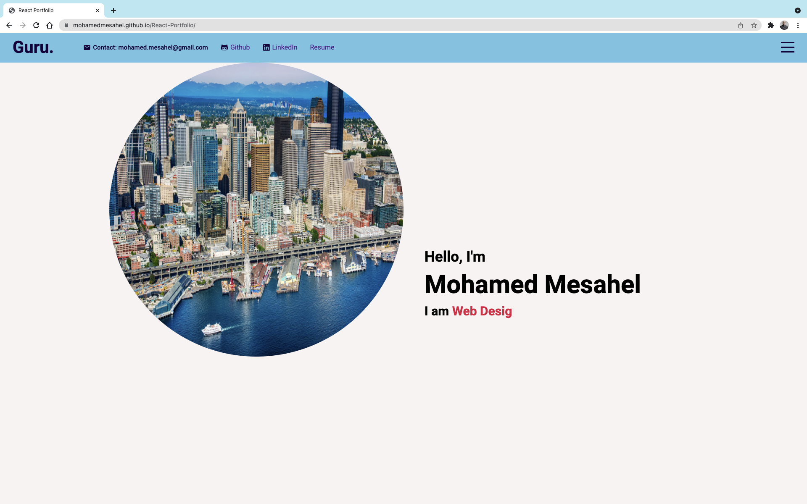
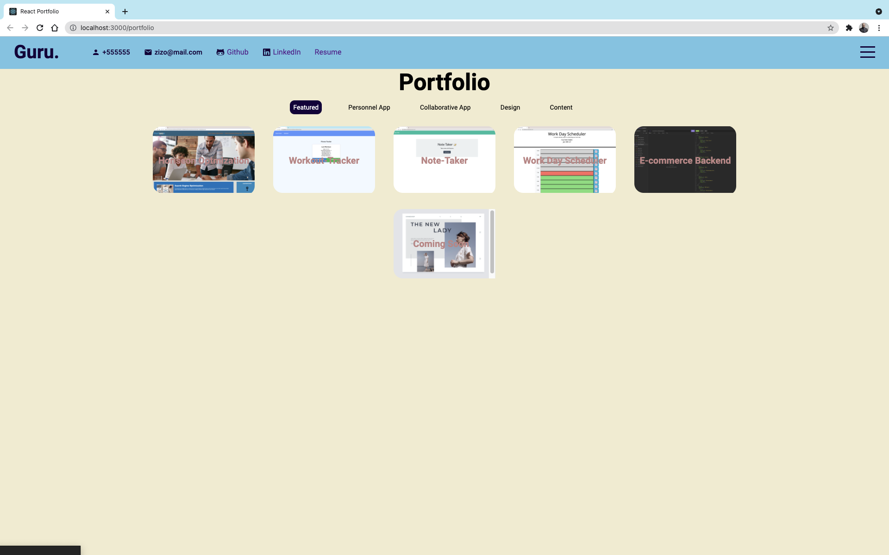
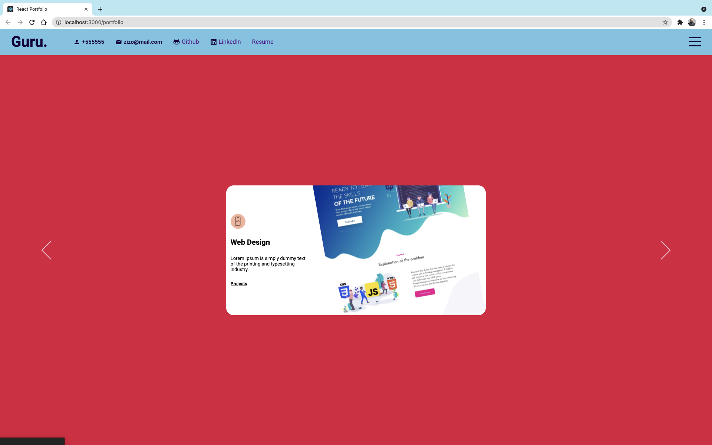
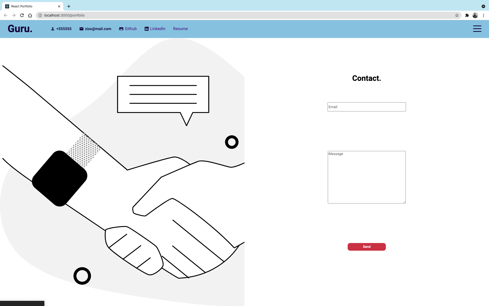

# React Portfolio
My first React Portfolio

## About
This is my first react personal portfolio built using React and SASS. I will be continually adding projects, modifying content, and updating the the final appearence and functionality.

## Table of Contents
* [Installation](#installation)
* [User-Stroy](#User-Story)
* [Screen-Shots](#Screen-Shots)

## Installation
- You can visit the deployed app here : [React Portfolio](https://mohamedmesahel.github.io/portfolio/).

- If you want to run the app on your local server download it through Github.
- Run npm i or (npm install), to make sure to download all the necessary files in the jason package.
- In your command shell run npm start.

### Screen Shots





## User Story

```md
AS AN employer looking for candidates with experience building single-page applications
I WANT to view a potential employee's deployed React portfolio of work samples
SO THAT I can assess whether they're a good candidate for an open position
```

## Reasons for this Project
To provide a start up interactive portfolio page with some ifno regarding the developer

**Coded with:**
- React.js
- Node.js
- Sass
- HTML
- Ityped